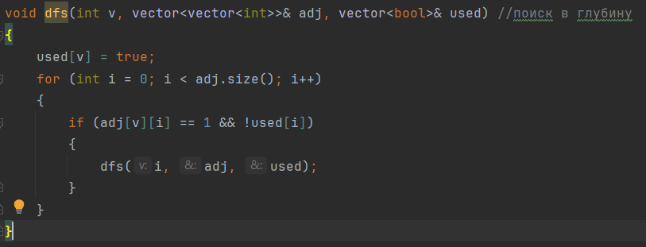

# Расчетная работа. Теория графов
## Цель:
 Ознакомиться с понятием графов.
- Выяснить, какие виды графов бывают.
- Ознакомиться со способами представления графов в памяти компьютера.
- Научиться решать теоретико-графовые задачи.

## Вариант:
Вариант 2.6. Граф задается матрицей смежности. Необходимо найти число вершинной связности графа.

Варианты можно найти [тут](https://drive.google.com/file/d/1-rSQZex8jW-2DlY2kko18gU1oUAtEGHl/view).

## Пошаговое выполнение работы:

### 1.Обход в глубину (DFS)

Принимает параметры:
 * v: текущая вершина
 * adj: матрица смежности графа
 * used: массив посещенных вершин

Рекурсивно обходит все достижимые вершины из текущей;
Помечает посещенные вершины в массиве used.

### 2. Проверка графа на связность:

Проверяет связность графа:
* Запускает DFS из вершины 0
* Если после обхода остались непосещенные вершины, граф несвязный
* Возвращает true, если граф связный, и false иначе
