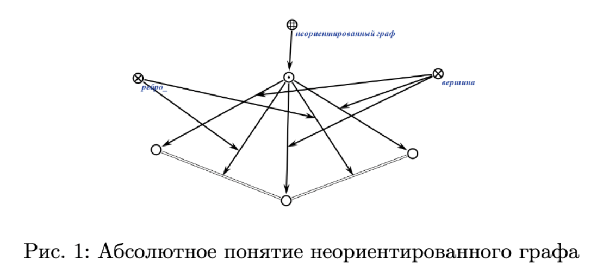

# Расчётная работа

---

### Цели:
Получить навыки формализации и обработки информации с использованием семантических сетей.

## Задание:
Найти минимальную степень ребра в неориентировочном графе. 

### Основные понятия:
***Неориентировочный граф*** — граф, в котором все ребра являются звеньями, то есть порядок двух концов ребра графа не существенен.
(a) вершина (относительное понятие, ролевое отношение); 
(b) связка (относительное понятие, ролевое отношение).

***Степень вершины*** - это количество рёбер, инцидентных (подключённых) к этой вершине. В неориентированном графе степень вершины - это количество вершин, с которыми она связана.

КАРТИНКА2

***Степень ребра*** - в неориентировочном графе - это количество ребер, инцидентных вершинам, которые это ребро совершает.

КАРТИНКА3

### Тестовые примеры:

#### Тест 1
##### Вход:
Необходимо найти минимальное значение степени ребра неориентировочного графа. 
КАРТИНКА4
##### Выход:
Будет найдено значение: минимальная степень ребра неориентировочного графа.
КАРТИНКА5

#### Тест 2
##### Вход:
Необходимо найти минимальное значение степени ребра неориентировочного графа. 
КАРТИНКА6
##### Выход:
Будет найдено значение: минимальная степень ребра неориентировочного графа.
КАРТИНКА7

#### Тест 3
##### Вход:
Необходимо найти минимальное значение степени ребра неориентировочного графа. 
КАРТИНКА8
##### Выход:
Будет найдено значение: минимальная степень ребра неориентировочного графа.
КАРТИНКА9

#### Тест 4
##### Вход:
Необходимо найти минимальное значение степени ребра неориентировочного графа. 
КАРТИНКА10
##### Выход:
Будет найдено значение: минимальная степень ребра неориентировочного графа.
КАРТИНКА11

### Алгоритм:
1. Инициализация множества, вершин и рёбер;
2. Создание переменной для хранения минимальной степени ребра;
3. Поиск смежных вершин для каждой вершины;
4. Инициализацияв поиска, минимальной степени для каждого ребра;
5. Обход всех рёбер;
6. Завершение обхода всех ребер;
7. Вывод результала.

#### Пример:
1. **graph** получит в качестве значения sc-неориентировочного графа.
   КАРТИНКА12
2. Инициализируем переменную **minimum edge degree** для минимальной степени ребра.
   КАРТИНКА13
3. Для вершины и создаём счётчик **degree U**, который будет хранить степень этой вершины, и аналогично для вершины у — переменная **degreeV**. Мы будем вычислять эти степени для каждой вершины графа на основе матрицы смежности.
   КАРТИНКА14
4. Для каждой вершины u и v, между которыми есть ребро, считаем сумму степеней этих вершин и записываем в переменную **edge degree**.
   КАРТИНКА15
5. Если значение **edge degree** меньше значения minimum **edge degree**, то присваиваем значение переменной **edge degree** переменной **minimum edge degree**.
   КАРТИНКА16
6. Таким образом, vы получаем переменную **minimum Edge Degree**, которая содержит то, что мы искали.
   КАРТИНКА17

### Вывод:
В заключении у нас получилось формализовать поставленную задачу. Мы нашли нужные нам числовые значения. Реализовали алгоритм их поиска, который работает на любом неориентированном связном графе.

---

### Использованные источники:
- Оре О. Теория графов.- 2-е изд.. — М.: Наука, 1980. - С. 336.
- Кормен Т. Х. и др. Часть VI. Алгоритмы для работы с графами // Алгоритмы: построение и анализ = Introduction to Algorithms. - 2-е изд.. - М.: Вильямс, 2006. - С. 1296.
- Харари, Ф. Теория графов / Ф. Харари / Пер. с англ. и предисл. В.П. Козырева. Под ред. Г.П. Гаврилова. Изд. 2-е. – М.: Едиториал УРСС, 2003. - 269 с.
- Нечипуренко, М. И. Алгоритмы и программы решения задач на графах и сетях / М.И. Нечи- пуренко, В.К. Попков, С.М. Майнагашев и др. Новосибирск: Наука. Сиб. отд-ние, 1990.
515 с.
