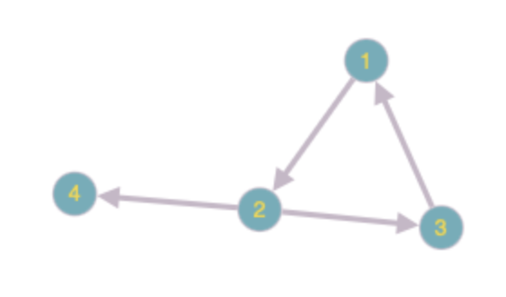
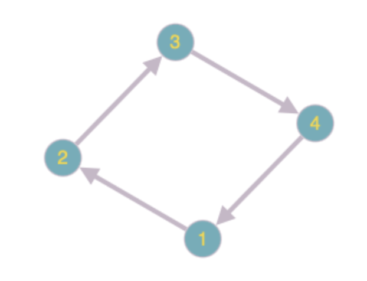
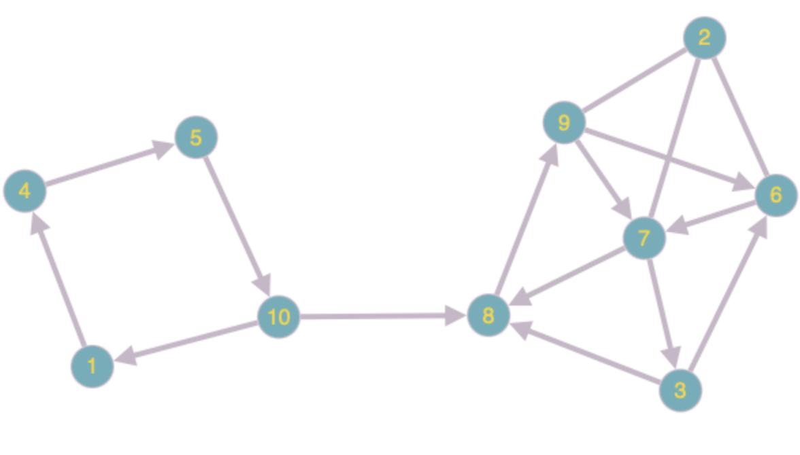
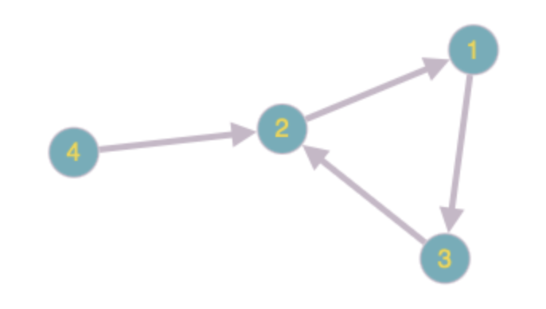

# Расчётная работа. Теория графов
## Цель работы
- Ознакомиться с понятием графов.
- Выяснить, какие виды графов бывают.
- Ознакомиться со способами представления графов в памяти компьютера.
- Научиться решать теоретико-графовые задачи.
## Задачи
- Реализовать алгоритм на языке программирования C++, решающий теоретико-графовую задачу в соответствии с выданным вариантом. Программа должна соответствовать следующим требованиям:
    - Для представления графа должна использоваться структура данных, соответствующая выданному варианту.
    - Использование глобальных переменных в программе недопустимо.
- Проверить данный алгоритм на корректность, написав для этого минимум 5 тестов.
## Вариант
Мой вариант - 4.16 [руководства](https://drive.google.com/file/d/1-rSQZex8jW-2DlY2kko18gU1oUAtEGHl/view). Структура данных — матрица смежности. Необходимо найти граф конденсации для орграфа.
## Список ключевых понятий, использовавшихся при решении задачи
### Основные определения
- Граф есть совокупность двух множеств — непустого множества _V_ и множества _E_ неупорядоченных пар различных элементов множества _V_. Множество _V_ называется множеством вершин, множество _E_ называется множеством рёбер.
    - Обычно граф изображают диаграммой: вершины — точками, ребра — линиями. Для простоты понимания будем считать, что граф — это конечная совокупность вершин, некоторые из которых соединены ребрами.

- Граф может быть ориентированным и неориентированным.
    - Ориентированный граф (орграф) — это граф, у которого хотя бы одно ребро имеет направление (из одной вершины в другую можно пройти лишь в одну сторону).
    - Неориентированный граф — граф, у которого рёбра не имеют направления.

Пример орграфа:


- Путём в графе называется последовательность вершин, каждая из которых соединена со следующей ребром.
    - Циклом называется путь, в котором начальная и конечная вершины совпадают.
На примере ниже циклом является путь 1-2-3-1 в этом графе.

- Обратным графом графу _G_ называется ориентированный граф с тем же набором вершин и с теми же дугами, что и у _G_ но ориентация дуг этого графа противоположна ориентации дуг графа _G_. Иногда такой граф также называют транспонированным.
- 
  [Граф и его обратный вариант](https://www.google.com/url?sa=i&url=https%3A%2F%2Fru.ruwiki.ru%2Fwiki%2F%25D0%25A2%25D1%2580%25D0%25B0%25D0%25BD%25D1%2581%25D0%25BF%25D0%25BE%25D0%25BD%25D0%25B8%25D1%2580%25D0%25BE%25D0%25B2%25D0%25B0%25D0%25BD%25D0%25BD%25D1%258B%25D0%25B9_%25D0%25B3%25D1%2580%25D0%25B0%25D1%2584&psig=AOvVaw11cIV2VoCTj5QS8Q0zINtx&ust=1730063464220000&source=images&cd=vfe&opi=89978449&ved=0CBQQjRxqFwoTCICKp-P6rIkDFQAAAAAdAAAAABAJ).
  
- Граф называется связным если между любой парой вершин существует хотя бы один путь. Рассмотрим пример ниже. Если у графа не будет ребра, проведённого штрихами, то граф будет называться _несвязным_. А если ребро будет присутствовать — _связным_.


- Компонента связности графа — это набор вершин графа, между любой парой которых существует путь. Т. е. _подграф_ (часть графа), являющийся связным. У графа, показанного на изображении ниже есть 2 компоненты связности.

- Две вершины ориентированного графа связаны сильно, если существует путь из одной в другую и наоборот. Иными словами, они обе лежат в каком-то цикле.
    - Все вершины распадаются на _компоненты сильной связности_ — такое разбиение вершин, что внутри одной компоненты все вершины сильно связаны, а между вершинами разных компонент сильной связности нет.
На примере ниже видно, что у данного графа три компоненты сильной связности (Вершины под номерами 1, 4, 7 находятся в одной компоненте; 3, 6, 9 — в другой и 5, 2, 8 — в третьей).

- Часто рассматривают граф, составленный из самих компонент сильной связности, а не индивидуальных вершин. Такой граф будет куда более компактным, и с ним станет проще работать. Задачу о сжатии каждой компоненты сильной связности в одну вершину называют _конденсацией_ графа, а граф, полученный в результате решения данной задани — графом конденсации.
### Алгоритмы на графах
- Матрица смежности — способ представления графа из _N_ вершин, в котором он (граф) задается матрицей _N*N_, в которой g\[i\]\[j\] — логическое значение, true (1) или false (0), обозначающее, существует ли ребро из вершины _i_ в вершину _j_. Для примера рассмотрим следующий граф:
  


Для данного графа матрица смежности будет следующая:
```
0 1 1 0 0 0
0 0 0 0 0 0
0 0 0 1 1 0
0 0 0 0 0 0
0 0 0 0 0 1
0 0 1 0 0 0
```
- Обход графа в глубину, или DFS (англ. depth-first search). Стратегия поиска в глубину состоит в том, чтобы идти «вглубь» графа настолько, насколько это возможно, а после упора в тупик пойти обратно до ближайшей развилки, после встречи с которой пойти туда, где ещё не были, повторяя алгоритм.


В коде (C++) обход в глубину можно описать так (использовалась матрица смежности):
```C++
/*
 g - матрица смежности графа.
 n - количество вершин в графе.
 explored - массив булевых значений из n элементов. Если explored[v] истинно,
то вершина v уже была посещена данным алгоритмом.
 */
void DFS(int vertex)
{
    explored[vertex] = true;

    /* обработка вершины с номером vertex */

    for (int i = 0; i < n; i++)
    {
        if (g[vertex][i] && !explored[i])
        {
            DFS(i);
        }
    }
}
```
- Топологическая сортировка графа — это способ нумерации вершин ориентированного графа, при котором каждое ребро ведёт из вершины с меньшим номером в вершину с большим номером. Алгоритм тривиально определяется через DFS. Будем присваивать номера в убывающем порядке: от большего к меньшему (и, соответственно, от дальнего к ближнему).
    - При реализвции, вместо явного присваивания вершинам номеров, будем добавлять их в массив по мере нумерации, после чего развернем массив и получим топологическую сортировку.
```C++
/*
 g - матрица смежности графа.
 n - количество вершин в графе.
 explored - массив булевых значений из n элементов. Если explored[v] истинно,
то вершина v уже была посещена данным алгоритмом.
 order - порядок вершин, участвовавших в обходе графа.
 */
void DFS(int vertex)
{
    explored[vertex] = true;
    
    /* обработка вершины с номером vertex */

    for (int i = 0; i < n; i++)
    {
        if (g[vertex][i] && !explored[i])
        {
            DFS(i);
        }
    }

    order.push_back(vertex);
}
```
## Алгоритм решения задачи
### Некоторые определения для понимания алгоритма
- Время входа t<sub>in</sub>(_V_) в вершину _V_ — время, после которого на пути к рассматриваемой вершине появляется вершина _V_.
- Время выхода t<sub>out</sub>(_V_) из вершины _V_ — время, после которого на пути к рассматриваемой вершине больше не встречается вершина _V_.
- Время входа t<sub>in</sub>(_C_) в компоненту сильной связности _C_ — min(_V_) ∀_V_∊_С_.
- Время выхода t<sub>out</sub>(_C_) из компоненты сильной связности _C_ — max(_V_) ∀_V_∊_С_.
### Алгоритм
- Алгоритм основан на двух сериях поисков в глубину и работает за _O(n + m)_, где _n_ - число вершин, а _m_ - число рёбер.
    1. Сначала запустим серию поисков в глубину, посещающую весь граф. При этом для каждой вершины _V_ запомним время выхода t<sub>out</sub>(_V_).
    - __Лемма__. Пусть C и C' — две различные компоненты сильной связности, и пусть в графе конденсации между ними есть ребро C -> C'. Тогда t<sub>out</sub>(_C_) > t<sub>out</sub>(_C'_).
    - __Доказательство__. Рассмотрим 2 случая (в зависимости от того, в какую из компонент поиск в глубину зайдет первым).
        1. Пусть первой была достигнута компонента _C_, то есть в какой-то момент времени DFS заходит в некоторую вершину _V_ компоненты _C_, и при этом все остальные вершины компонент _C_ и _C'_ ещё не посещены. Но так как по условию в графе конденсации есть ребро _C_ -> _C'_, то из вершины _V_ будет достижима не только вся компонента _C_, но и вся компонента _C'_. Это означает, что при запуске из вершины _V_ обход в глубину пройдёт по всем вершинам компонент _C_ и _C'_, а, значит, они будут посещены позже, чем _V_, и ∀ _U_∊A∪B, _U_≠_V_ будет выполнено t<sub>out</sub>(_V_)>t<sub>out</sub>(_U_), ч. т. д.
        2. Второй случай проще: из _C'_ по условию нельзя дойти до _C_, а значит, если первой была достигнута _C'_, то DFS выйдет из всех её вершин ещё до того, как войти в _C_. Отсюда и следует t<sub>out</sub>(_C_)>t<sub>out</sub>(_C'_), ч. т. д.
    - Из вышесказанного следует, что любое ребро _C_ -> _C'_ в графе конденсации идёт из компоненты с большей величиной t<sub>out</sub> в компоненту с меньшей величиной. Т. е. в порядке топологической сортировки (говорить о топологической сортировке для графа с циклами некорректно, однако алгоритм выделения компонент с большей и меньшей величиной t<sub>out</sub> будет идентичен, поэтому для простоты я буду называть это так).
    2. После выполнения топологической сортировки первой окажется некоторая вершина _U_, принадлежащая компоненте сильной связности, в которую не входит ни одно дргуое ребро в графе конденсации. Далее нам необходимо запустить такой обход из этой вершины _U_, который бы посетил только эту компоненту сильной связности и не зашёл ни в какую другую. Для этого рассмотрим обратный граф _G_<sup>_C_</sup>. Заметим, что этом графе будут те же компоненты сильной связности, что и в исходном графе и граф конденсации графа _G_<sup>_C_</sup> будет равен обратному графу конденсации изначального графа. Отсюда следует, что из рассматриваемой нами компоненты уже не будет выходить никаких рёбер в другие компоненты. Т. е. подзадача решена.
    3. Если мы знаем, какие вершины лежат в каждой компоненте сильной связности, то построить граф конденсации несложно. Он всегда имеет вид 1 -> 2 -> ... -> _S_, где _S_ — количество компонент сильной связности графа.
- Резюмируя, алгоритм получается следующий:
    1. Запустить алгоритм топологической сортировки на исходном графе _G_ (в программе - g).
```C++
    void topologicalSortDFS(const std::vector< std::vector<bool> >& g, size_t vertex, std::vector<bool>& explored, std::vector<size_t>& order)
{
	explored[vertex] = true;
	
	for (size_t i = 0; i < g.size(); i++)
	{
		if (g[vertex][i] && !explored[i])
		{
			topologicalSortDFS(g, i, explored, order);
		}
	}
	
	order.push_back(vertex);
}

std::vector<size_t> topologicalSort(const std::vector< std::vector<bool> >& g)
{
	std::vector<bool> explored(g.size(), false);
	std::vector<size_t> order;
	
	for (size_t i = 0; i < g.size(); i++)
	{
		if (!explored[i])
		{
			topologicalSortDFS(g, i, explored, order);
		}
	}
	
	std::reverse(order.begin(), order.end());
	
	return order;
}
```
2. На обратном графе G<sup>C</sup> запустить серию обходов в глубину этого графа в порядке, определяемом порядком топологической сортировки (массив _order_).  Каждое множество вершин, достигнутое в результате очередного запуска обхода, и будет очередной компонентой сильной связности.
```C++
void getComponent(const std::vector< std::vector<bool> >& gC, size_t vertex, std::vector<bool>& explored, std::vector<size_t>& component)
{
	explored[vertex] = true;
	
	component.push_back(vertex);
	
	for (size_t i = 0; i < gC.size(); i++)
	{
		if (gC[vertex][i] && !explored[i])
		{
			getComponent(gC, i, explored, component);
		}
	}
}

std::vector< std::vector<size_t> > stronglyConnectedComponents(const std::vector< std::vector<bool> >& g)
{
	std::vector< std::vector<bool> > gC = converseGraph(g);
	
	std::vector<bool> explored(gC.size(), false);
	std::vector< std::vector<size_t> > components;
	
	for (size_t i = 0; i < gC.size(); i++)
	{
		size_t currentVertex = order[i];
		if (!explored[currentVertex])
		{
			std::vector<size_t> currentComponent;
			getComponent(gC, currentVertex, explored,currentComponent);
			components.push_back(currentComponent);
		}
	}
	
	return components;
}
```
    3. Выведем граф конденсации в консоль.
```C++
    for (size_t i = 1; i <= gSCC.size(); i++)
	{
		std::cout << i;
		if (i < gSCC.size())
		{
			std::cout << " -> ";
		}
	}
```
## Тестовые примеры.
1. Количество вершин графа n=4, матрица смежности данного графа следующая:
```
0 1 0 0
0 0 1 1
1 0 0 0
0 0 0 0
```
Визуально граф можно представить так:

- Ответ программы:
```
Все вершины данного графа, входящие в 1-ю вершину графа конденсации: 1, 2, 3
Все вершины данного графа, входящие во 2-ю вершину графа конденсации: 4

Граф конденсации будет выглядеть следующим образом:
1 -> 2

Матрица смежности графа конденсации выглядит так:
0 1 
0 0 
```
2. Количество вершин графа n=7, матрица смежности данного графа следующая:
```
0 1 1 0 0 0 0
0 0 1 0 0 0 0
0 0 0 1 1 0 0
1 0 0 0 0 0 0
0 0 0 0 0 1 0
0 0 0 0 0 0 1
0 0 0 0 0 0 0
```
Визуально граф можно представить так:

- Ответ программы:
```
Все вершины данного графа, входящие в 1-ю вершину графа конденсации: 1, 2, 3, 4
Все вершины данного графа, входящие во 2-ю вершину графа конденсации: 5
Все вершины данного графа, входящие в 3-ю вершину графа конденсации: 6
Все вершины данного графа, входящие в 4-ю вершину графа конденсации: 7

Граф конденсации будет выглядеть следующим образом:
1 -> 2 -> 3 -> 4

Матрица смежности графа конденсации выглядит так:
0 1 0 0 
0 0 1 0 
0 0 0 1 
0 0 0 0 
```
3. Количество вершин графа n=4, матрица смежности данного графа следующая:
```
0 1 0 0
0 0 1 0
0 0 0 1
1 0 0 0
```
Визуально граф можно представить так:

- Ответ программы:
```
Все вершины данного графа, входящие в 1-ю вершину графа конденсации: 1, 2, 3, 4

Граф конденсации будет выглядеть следующим образом:
1

Матрица смежности графа конденсации выглядит так:
0
```
4. Количество вершин графа n=9, матрица смежности данного графа следующая:
```
0 0 0 1 0 0 0 0 0 
0 0 0 0 0 0 0 1 0 
0 0 0 0 0 1 0 0 0 
0 0 0 0 0 0 1 0 0 
0 1 0 0 0 0 0 0 0 
0 0 0 0 0 0 0 0 1 
1 0 0 0 0 0 0 0 0 
0 0 0 0 1 1 0 0 0 
0 0 1 0 0 0 1 0 0
```
Визуально граф можно представить так:

- Ответ программы:
```
Все вершины данного графа, входящие в 1-ю вершину графа конденсации: 2, 5, 8
Все вершины данного графа, входящие во 2-ю вершину графа конденсации: 3, 6, 9
Все вершины данного графа, входящие в 3-ю вершину графа конденсации: 1, 4, 7

Граф конденсации будет выглядеть следующим образом:
1 -> 2 -> 3

Матрица смежности графа конденсации выглядит так:
0 1 0 
0 0 1 
0 0 0 
```
5. Количество вершин графа n=10, матрица смежности данного графа следующая:
```
0 0 0 1 0 0 0 0 0 0 
0 0 0 0 0 1 1 0 1 0 
0 0 0 0 0 1 0 1 0 0 
0 0 0 0 1 0 0 0 0 0 
0 0 0 0 0 0 0 0 0 1 
0 1 0 0 0 0 1 0 0 0 
0 1 1 0 0 0 0 1 0 0 
0 0 0 0 0 0 0 0 1 0 
0 1 0 0 0 1 1 0 0 0 
1 0 0 0 0 0 0 1 0 0
```
Визуально граф можно представить так:

- Ответ программы:
```
Все вершины данного графа, входящие в 1-ю вершину графа конденсации: 1, 4, 5, 10
Все вершины данного графа, входящие во 2-ю вершину графа конденсации: 2, 3, 6, 7, 8, 9

Граф конденсации будет выглядеть следующим образом:
1 -> 2

Матрица смежности графа конденсации выглядит так:
0 1 
0 0 
```
## Детализация преобразований входной конструкции в выходную
- Рассмотрим преобразование на первом тестовом примере (нумерация вершин и различных индексов начинается с нуля):
```
4
0 1 0 0
0 0 1 1
1 0 0 0
0 0 0 0
```
1. Получение топологической сортировки графа.
    - С помощью описанного выше алгоритма топологической сортировки (банального обхода графа в глубину) находим её для заданного данной матрицей смежности графа. Топологической сортировкой этого графа будет массив _order_, в котором будут храниться значения:
```
{ 0, 1, 3, 2 }
```
2. Получение обратного графа _G_<sup>_C_</sup> графу _G_, заданному в условии.
    - Алгоритм также тривиален. Необходимо лишь транспонировать матрицу смежности. Матрица смежности графа _G_<sup>_C_</sup> будет такой:
```
0 0 1 0
1 0 0 0
0 1 0 0
0 1 0 0
```
А сам граф _G_<sup>_C_</sup> выглядит так:

3. Получаем компоненты сильной связности графа.
    - Обходим в глубну граф _G_<sup>_C_</sup> в порядке топологической сортировки (в данном случае, начиная с элемента 0) и добавляем все встретившиеся в процессе элементы.
        - В первый раз встретятся элементы 0, 1 и 2 и добавится массив из этих элементов. После второго обхода в глубину в массив, где хранится результат, добавится массив из одного элемента 3.
    - Итого в результате пункта 3 будет создан массив _components_, где хранятся следующие значения:
```
{ { 0, 1, 2 },
  { 3 } }
```
4. Зная количество компонент сильной связности, несложно будет построить граф конденсации. В данном случае компоненты две, значит и граф конденсации будет иметь вид 1 -> 2.
5. Построение матрицы смежности такого графа — также вполне простая задача.
## Вывод
В ходе выполнения данной расчётной работы я:
- Ознакомился с понятием графов.
- Выяснил, какие виды графов бывают (ориентированные/неориентированные, связные/несвязные).
- Ознакомился со таким способом представления графов в памяти компьютера, как матрица смежности.
- Реализовал алгоритм решения задачи 4.16 [руководства](https://drive.google.com/file/d/1-rSQZex8jW-2DlY2kko18gU1oUAtEGHl/view) на языке программирования C++ с использованием матрицы смежности и без использованя глобальных переменных.
- Проверил данный алгоритм на корректность при помощи придуманных мной пяти тестов.
## Использованные источники
1. Свободная энциклопедия "Википедия" \[Электронный ресурс\]. — Режим доступа: https://ru.wikipedia.org/wiki/Граф_(математика)
2. Свободная энциклопедия "Википедия" \[Электронный ресурс\]. — Режим доступа: https://ru.wikipedia.org/wiki/Транспонированный_граф
3. Сайт "MAXimal :: algo" \[Электронный ресурс\]. — Режим доступа: http://e-maxx.ru/algo/strong_connected_components
4. Сайт "Algocode wiki" \[Электронный ресурс\]. — Режим доступа: https://wiki.algocode.ru/index.php?title=Конденсация_графа
5. Сайт "Олимпиадное программирование в Бресте и Беларуси" \[Электронный ресурс\]. — Режим доступа: https://brestprog.by/topics/graphs/
6. Сайт "Олимпиадное программирование в Бресте и Беларуси" \[Электронный ресурс\]. — Режим доступа: https://brestprog.by/topics/dfs/
7. Сайт "Олимпиадное программирование в Бресте и Беларуси" \[Электронный ресурс\]. — Режим доступа: https://brestprog.by/topics/connectivity/
8. Сайт "Олимпиадное программирование в Бресте и Беларуси" \[Электронный ресурс\]. — Режим доступа: https://brestprog.by/topics/topsort/
