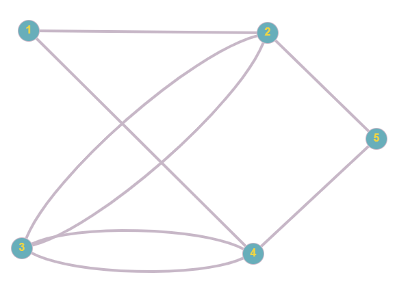
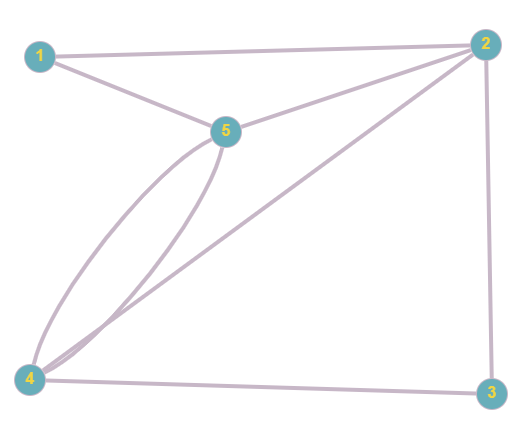
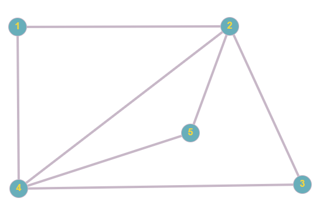

# Расчётная работа.
## Тема работы
Тема работы - основы теории графов, базовые алгоритмы на графах.
## Цель работы
- Ознакомиться с понятием графа.
- Узнать какие бывают графы.
- Ознакомиться с различными способами представления графов.
- Научиться сотставлять алгоритмы для решения теоретико-графовых задач.
## Задачи
- Необходимо разработать алгоритм и перенести его на С/С++, который решает выданную преподавателем теоретико-графовую задачу и соответствует следующим требованиям:
    - Необходимо использовать определенную структуру данных для представления графа.
    - Использование глобальных переменных в программе недопустимо.
    - При своем запуске программа должна в автоматическом режиме стартовать 5 разнообразных примеров решения задачи и выводить результаты работы на консоль.
## Вариант
Я выполнил вариант 5.2 из [руководства](https://drive.google.com/file/d/1-rSQZex8jW-2DlY2kko18gU1oUAtEGHl/view?usp=drive_link). Необходимо найти эйлеров цикл в неориентированном графе. Структура представления данных — матрица инцендентности.
## Список ключевых понятий, использовавшихся при решении задачи
### Основные определения
- **Граф** - это топологичекая модель, которая состоит из множества вершин и множества соединяющих их рёбер. При этом значение имеет только сам факт, какая вершина с какой соединена.
- Графы, как правило, отображаются графически при помощи точек для представления вершин и отрезков, или ломаных, для отображения рёбер между связанными вершинами. Ориентация ребра (в ориентированном графе) отображается при помощи стрелки.
- Инцидентность - вершина и ребро называются инцидентными, если вершина является для этого ребра концевой. Термин “инцидентность” применим только к вершине и ребру. 
  Пример графа:
   

- Граф может быть ориентированным и неориентированным.
    - **Ориентированный граф** (кратко орграф) — граф, рёбрам которого присвоено направление. Направленные рёбра именуются также дугами, а в некоторых источниках и просто рёбрами.
    - Граф, ни одному ребру которого не присвоено направление, называется **неориентированным графом**(неорграфом).

На рисунке выше изображен ориентированный граф, а ниже приведен пример неорграфа:


- **Путем (или маршрут)**  - это последовательность смежных рёбер. Обычно путь задаётся перечислением вершин, по которым он пролегает.

- Подграф. Если в исходном графе выделить несколько вершин и несколько рёбер (между выбранными вершинами), то мы получим подграф исходного графа. 
  
- Граф называется **связным**,  если содержит ровно одну компоненту связности. Это означает, что между любой парой вершин этого графа существует как минимум один путь.


- Компонента связности - множество таких вершин графа, что между любыми двумя вершинами существует маршрут.

- Цикл Эйлера - цикл, проходящий по каждому ребру ровно один раз. Эйлер доказал, что такой цикл существует тогда, и только тогда, когда все вершины в связанном графе имеют чётную степень.

- Степень вершины - это количество рёбер, инцидентных указанной вершине. По-другому - количество рёбер, исходящих из вершины.

## Основные алгоритмы на графах, которые были использованы при решениии теоретико-графовой задачи

- **Матрица инцидентности**  — одна из форм представления графа, в которой указываются связи между инцидентными элементами графа (ребро(дуга) и вершина). Столбцы матрицы соответствуют ребрам, строки — вершинам. Ненулевое значение в ячейке матрицы указывает связь между вершиной и ребром (их инцидентность).


Для данного графа матрица инцидентности выглядит следующим образом:

```
1 0 0 0 0 0 0
1 1 0 0 0 0 0
0 1 0 1 0 0 0
0 0 1 0 1 0 1
0 0 0 1 0 1 0
0 0 1 0 1 1 1
```

- **Поиск в глубину** (DFS) — один из методов обхода графа. Стратегия поиска в глубину, как и следует из названия, состоит в том, чтобы идти «вглубь» графа, насколько это возможно. Алгоритм поиска описывается рекурсивно: перебираем все исходящие из рассматриваемой вершины рёбра. Если ребро ведёт в вершину, которая не была рассмотрена ранее, то запускаем алгоритм от этой нерассмотренной вершины, а после возвращаемся и продолжаем перебирать рёбра.

Пример порядка поиска в глубину:


Реализация обхода в глубину на ЯП C++:

``` C++
/*
list - список смежности графа
visited - массив элементов, в котором visited[i]=1, если вершина была посещена в данном поиске в глубину
start - номер текущей вершины
*/
void dfs_realize(vector<vector<int>> list, int start, vector<int>& visited) {
	visited[start] = 1;

	for (int i = 0; i < list[start].size(); i++) {
		if(!visited[list[start][i]])
		dfs_realize(list, list[start][i], visited);
	}
}
```

## Алгоритм решения поставленной задачи

- Сложность алгоритма — O(E) времени, где E — кол-во рёбер.

# Рассмотрим алгоритм подробнее:

1. Проверяем граф на существование цикла эйлера.
   1.1. Проверяем четность вершин графа.
   1.2. С помощью обхода в глубину проверяем связность графа.
2. Выбираем вершину и начинаем обход по ребрам, пока не придем в вершину из которой не выходят ребра.
3. Проверяем все ли ребра мы посетили, если нет то до тех пор, пока не посетим все создаем подграф из непосещенных ребер и инцидентным им вершин и применяем к нему пункт 2.

# В итоге получается данный алгоритм:

1. Проверка графа, если в результате какой-лтбо проверки возвращается false, выводим в консоль запись о том, что цикла эйлера в данном графе не существует.
1.1. Проверяем четность вершин графа.

```C++
/*
matrix - граф в виде матрицы инцидентности
rows - количество вершин
cols - количество ребер
counter - счетчик степени вершины
*/
for (int i = 0; i < rows; i++) {
	int counter = 0;
	for (int j = 0; j < cols; j++) {
		counter += matrix[i][j];
	}
	if (counter % 2 != 0)
		return false;
}

```
1.2. Проверяем связность графа
```C++
/*
smeg_list - список смежности графа
visited - массив элементов, в котором visited[i]=1, если вершина была посещена в данном поиске в глубину
start - номер текущей вершины 
*/
vector<int> visited(rows);
dfs_realize(smeg_list, start, visited);

for (int i = 0; i < rows; i++) {
	if (!visited[i])
		return false;
}
```
2. Выбираем вершину и начинаем обход по ребрам, пока они не закончатся.
``` C++
/*
way_edge - массив для хранения пути, содержащий номера пройденных ребер
way_start - массив для хранения пути, содержащий номера пройденных вершин
start - вершина из которой мы выходи
edge - ребро по которому двигаемся
rows - количество вершин в графе
cols - количество ребер в графе
matrix - матрица инцидентности для графа
visited - массив элементов, в котором visited[i]=1, если ребро было посещено
*/
void find_part_way(vector<vector<int>> matrix, int rows, int cols, int start, int edge, vector<int>& visited, vector<int>& way_edge, vector<int>& way_start) {
way_edge.push_back(edge);
way_start.push_back(start);

for (int i = 0; i < rows; i++) {
	if (i != start && matrix[i][edge]) {
		visited[edge] = 1;
		for (int j = 0; j < cols; j++) {
			if (!visited[j] && j != edge && matrix[i][j]) {
				find_part_way(matrix, rows, cols, i, j, visited, way_edge, way_start);
				break;
			}
		}
		break;
	}
}
```
3.  Проверяем все ли ребра мы посетили, если нет то до тех пор, пока не посетим все создаем подграф из непосещенных ребер и инцидентным им вершин и применяем к нему пункт 2.
```C++
/*
cols - количество ребер
rows - количество вершин
miniway_edge - массив для хранения пути по ребрам в подграфе
miniway_start - массив для хранения пути по вершинам в подграфе
matrix - матрица инцидентности для графа
*/
for (int i = 0; i < cols; i++) {
	if (!visited[i]) {
		vector<int> miniway_edge;
		vector<int> miniway_start;
		for (int j = 0; j < rows; j++) {
			if (matrix[j][i]) {
				find_part_way(matrix, rows, cols, j, i, visited, miniway_edge, miniway_start);
				insert_way(way_edge, way_start, miniway_edge, miniway_start);
				break;
			}
		}
	}
}
```
функиця insert_way для интеграции пути в подграфе в путь в основном графе
```C++
/*
miniway_edge - массив для хранения пути по ребрам в подграфе
miniway_start - массив для хранения пути по вершинам в подграфе
way_edge - массив для хранения пути, содержащий номера пройденных ребер
way_start - массив для хранения пути, содержащий номера пройденных вершин
*/
void insert_way(vector<int>& way_edge, vector<int>& way_start, vector<int> miniway_edge, vector<int> miniway_start) {
	miniway_start.push_back(miniway_start[0]);
	for (int i = 0; i < way_start.size(); i++) {
		if (way_start[i] == miniway_start[0]) {
			for (int j = 0; j < miniway_edge.size(); j++) {
				way_start.insert(way_start.begin() + i, miniway_start[j + 1]);
				way_edge.insert(way_edge.begin() + i, miniway_edge[j]);
			}
			break;
		}
	}
}
```

## Тестовые примеры

- Рассмотрим первый тестовый пример:

  

Число вершин - 6, ребер - 7. Ниже матрица инцидентности для графа:

```
1 0 0 0 0 0 0
1 1 0 0 0 0 0
0 1 0 1 0 0 0
0 0 1 0 1 0 1
0 0 0 1 0 1 0
0 0 1 0 1 1 1
```

Вывод программы:

```
Test 1:
Цикл Эйлера не существует
```

- Рассмотрим второй тестовый пример:

  

Число вершин - 4, ребер - 8. Ниже матрица инцидентности для графа:

```
1 0 0 1 0 0 0 0
1 1 0 0 1 1 0 0
0 1 1 0 0 0 1 1
0 0 1 1 1 1 1 1
```

Вывод программы:

```
Test 2:
Edge_way: 1 6 5 2 8 7 3 4
Vertex_way: 1 2 4 2 3 4 3 4 1
Matrix:
1 0 0 0 0 0 0 1
1 1 1 1 0 0 0 0
0 0 0 1 1 1 1 0
0 1 1 0 1 1 1 1
```

- Рассмотрим третий тестовый пример:

  

Число вершин - 5, ребер - 8. Ниже матрица инцидентности для графа:

```
1 0 0 1 0 0 0 0
1 1 0 0 0 1 1 0
0 1 1 0 0 0 1 1
0 0 1 1 1 0 0 1
0 0 0 0 1 1 0 0
```

Вывод программы:

```
Test 3:
Edge_way: 1 2 3 8 7 6 5 4
Vertex_way: 1 2 3 4 3 2 5 4 1
Matrix:
1 0 0 0 0 0 0 1
1 1 0 0 1 1 0 0
0 1 1 1 1 0 0 0
0 0 1 1 0 0 1 1
0 0 0 0 0 1 1 0
```

- Рассмотрим четвёртый тестовый пример:

  

Число вершин - 5, ребер - 8. Ниже матрица инцидентности для графа:

```
1 0 0 0 0 1 0 0
1 1 0 1 1 0 0 0 
0 1 1 0 0 0 0 0
0 0 1 1 0 0 1 1 
0 0 0 0 1 1 1 1
```

Вывод программы:

```
Test 4:
Edge_way: 1 2 3 8 7 4 5 6
Vertex_way: 1 2 3 4 5 4 2 5 1
Matrix:
1 0 0 0 0 0 0 1
1 1 0 0 0 1 1 0
0 1 1 0 0 0 0 0
0 0 1 1 1 1 0 0
0 0 0 1 1 0 1 1
```

- Рассмотрим пятый тестовый пример:

  

Число вершин - 5, ребер - 7. Ниже матрица инцидентности для графа:

```
1 0 0 0 1 0 0
1 1 0 1 0 1 0
0 1 1 0 0 0 0
0 0 1 1 1 0 1
0 0 0 0 0 1 1
```

Вывод программы:

```
Test 5:
Edge_way: 1 2 3 4 6 7 5
Vertex_way: 1 2 3 4 2 5 4 1
Matrix:
1 0 0 0 0 0 1
1 1 0 1 1 0 0
0 1 1 0 0 0 0
0 0 1 1 0 1 1
0 0 0 0 1 1 0
```

## Детализация преобразования входной конструкции в выходную

- Рассмотрим работу программы на втором тестовом примере.


Входные данные:

```
4 8
1 0 0 1 0 0 0 0
1 1 0 0 1 1 0 0
0 1 1 0 0 0 1 1
0 0 1 1 1 1 1 1
```

1. Функция проверки графа на наличие в нем цикла эйлера вернет true.

2. После первого обхода по ребрам получим следующие значения в массивах way_edge и way_start.

```
way_edge: 1 2 3 4
way_start: 1 2 3 4 1
```

3. Так как не все ребра посещены, будем создавать подграфы, искать в них пути и интегрировать пути в основные.
пути в первом подграфе:
```
miniway_edge: 6 5
miniway_start: 2 4 2
```
после интеграции:
```
way_edge: 1 6 5 2 3 4
way_start: 1 2 4 2 3 4 1
```
пути во втором подграфе:
```
miniway_edge: 8 7
miniway_start: 3 4 3
```
после интеграции:
```
way_edge: 1 6 5 2 8 7 3 4
way_start: 1 2 4 2 3 4 3 4 1
```

## Вывод

В ходе выполнения расчетной работы:

- Было изучено понятие графа, некоторые типы графов, способы представления графа в памяти компьютера.
- Было решено индивидуальное, составлен и записан на языке программирование C++ алгоритм в соответствии с заданными требованиями.
- Алгоритм был проверен на пяти тестовых примерах.

## Список использованных источников

1. Свободная энциклопедия "Википедия" \[Электронный ресурс\]. – Режим доступа: [https://ru.wikipedia.org/wiki/Ориентированный_граф](https://ru.wikipedia.org/wiki/%D0%9C%D0%B0%D1%82%D1%80%D0%B8%D1%86%D0%B0_%D0%B8%D0%BD%D1%86%D0%B8%D0%B4%D0%B5%D0%BD%D1%82%D0%BD%D0%BE%D1%81%D1%82%D0%B8)
2. Свободная энциклопедия "Википедия" \[Электронный ресурс\]. – Режим доступа: [https://ru.wikipedia.org/wiki/Связный_граф#:~:text=Ориентированный%20граф%20называется%20сильно-связным,ровно%20одну%20сильно%20связную%20компоненту.](https://ru.wikipedia.org/wiki/%D0%9F%D0%BE%D0%B8%D1%81%D0%BA_%D0%B2_%D0%B3%D0%BB%D1%83%D0%B1%D0%B8%D0%BD%D1%83)
3. Свободная энциклопедия "Википедия" \[Электронный ресурс\]. – Режим доступа: [https://ru.wikipedia.org/wiki/Компонента_сильной_связности](https://ru.wikipedia.org/wiki/%D0%A1%D0%B2%D1%8F%D0%B7%D0%BD%D1%8B%D0%B9_%D0%B3%D1%80%D0%B0%D1%84)
4. Свободная энциклопедия "Википедия" \[Электронный ресурс\]. – Режим доступа: [https://ru.wikipedia.org/wiki/Граф_(математика)#Обобщение_понятия_графа](https://ru.wikipedia.org/wiki/%D0%9E%D1%80%D0%B8%D0%B5%D0%BD%D1%82%D0%B8%D1%80%D0%BE%D0%B2%D0%B0%D0%BD%D0%BD%D1%8B%D0%B9_%D0%B3%D1%80%D0%B0%D1%84)
5. Сайт "Хабр.Статьи" \[Электронный ресурс\]. - Режим доступа: [https://habr.com/ru/articles/537290/](https://habr.com/ru/companies/otus/articles/568026/)
