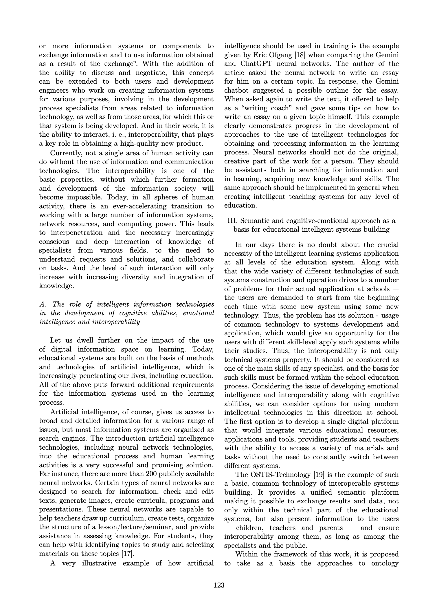

# Лабораторная работа №1. Работа с текстовым редактором.

## Цель работы:
- Познакомиться с системой верстки текстов TeX, языком верстки TeX, издательской системой LaTeX.
- Выполнить вариант индивидуального задания.


## Ход работы:
- Сверстать три страницы научной статьи с использованием системы верстки текстов TeX.
    - На [странице](https://proc.ostis.net/proc/Proceedings%20OSTIS-2024.pdf) необходимо взять доклад, соответствующий варианту индивидуального задания.
    - Доклад представлен в форме статьи в формате *.pdf.
    - Для написания формального текста предлагается воспользоваться пакетом макросов “scn-latex”.

Для выполнения данной лабораторной работы необходимо было:
1. Набирать текст на русском и английском языках. Для корректного отображения русских символов необходимо было подключить пакет для поддержки русского языка.
```LaTeX
\usepackage[russian]{babel}
```

2. Писать текст в 2 столбца. Чтобы сделать это необходимо было подключить пакет multicol
```LaTeX
\usepackage{multicol}
```
и заключить текст, который выводится в 2 колонки в этот блок:
```LaTeX
\begin{multicols}{2}
    % здесь будет текст, который необходимо вывести в 2 колонки...
\end{multicols}
```
Тогда текст будет выглядеть следующим образом:


3. Мой вариант начинается с 123 страницы, поэтому необходимо установить счётчик страниц на начальное значение 123. За это отвечает следующая команда:
```LaTeX
\setcounter{page}{123}
```

4. При выполнении работы также появилась необходимость в использовании нумерации римскими цифрами. Для этого было необходимо ввести следующую команду:
```LaTeX
\MakeUppercase{\romannumeral3}
```
Данная команда выведет цифру 3 в римском варианте (III).


## Выводы:
В результате этой работы был создан один pdf файл и один tex файл с исходниками статьи. В ходе из создания я:
- Познакомился с системой верстки текстов TeX, языком верстки TeX, издательской системой LaTeX.
- Познакомился с online-редактором [overleaf](https://www.overleaf.com).
