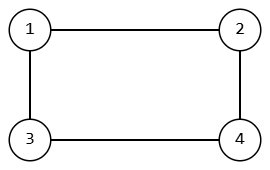
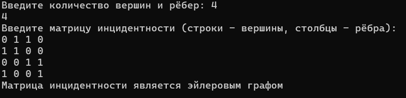
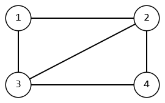
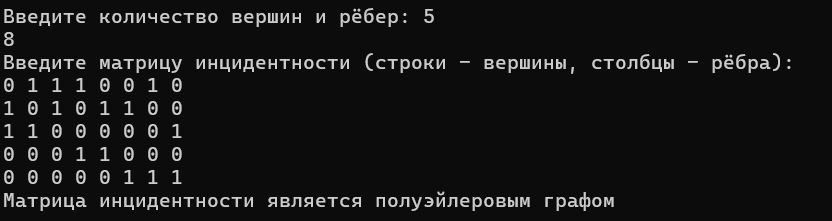

# Расчетная работа 

## Введение

### Цели: 
Научится работать и проводить различные операции с графами.

### Задача: 
Определить, является ли граф эйлеровым, либо полуэйлеровым.
### Вариант: 
1.3 (матрица инцидентности)

### Определения:

`Матрица инцидентности` — одна из форм представления графа, в которой указываются связи между инцидентными элементами графа (ребро(дуга) и вершина). Столбцы матрицы соответствуют ребрам, строки — вершинам. Ненулевое значение в ячейке матрицы указывает связь между вершиной и ребром (их инцидентность).

`Инцидентность` — понятие, используемое только в отношении ребра и вершины. Две вершины или два ребра не могут быть инцидентны.

`Граф` — математическая абстракция реальной системы любой природы, объекты которой обладают парными связями. Граф как математический объект есть совокупность двух множеств — множества самих объектов, называемого множеством вершин, и множества их парных связей, называемого множеством рёбер. Элемент множества рёбер есть пара элементов множества вершин.

`Эйлеров путь` (эйлерова цепь) в графе — это путь, проходящий по всем рёбрам графа и притом только по одному разу.

`Эйлеров цикл` — эйлеров путь, являющийся циклом, то есть замкнутый путь, проходящий через каждое ребро графа ровно по одному разу.

`Полуэйлеров граф` — граф, в котором существует эйлеров путь.

`Эйлеров граф` — граф, в котором существует эйлеров цикл.

### Алгоритм:
1.Пользователь вводит количество вершин и рёбер графа.              
2.Затем вводится матрица инцидентности, где строки представляют вершины, а столбцы — рёбра.             
3.Функции eul и halfeul определяют вид графа          
## Код программы:
```cpp
#include <iostream>
#include <vector>
#include <Windows.h>
using namespace std;

// проверка, является ли граф эйлеровым
bool eul(vector<vector<int>>& mat)
{
    int nech = 0;  // nech - количество вершин с нечетной степенью
    int n = mat.size(); // количество вершин
    int m = mat[0].size(); // количество рёбер

    for (int i = 0; i < n; i++)
    {
        int st = 0;  // st - степень вершины
        for (int j = 0; j < m; j++)
        {
            st = st + mat[i][j];
        }
        if (st % 2 != 0)
        {
            nech++;
        }
    }

    if (nech == 0)
    {
        return true;
    }
    else
    {
        return false;
    }
}

// проверка, является ли граф полуэйлеровым
bool halfeul(vector<vector<int>>& mat)
{
    int nech = 0;
    int n = mat.size(); // количество вершин
    int m = mat[0].size(); // количество рёбер

    for (int i = 0; i < n; i++)
    {
        int st = 0;
        for (int j = 0; j < m; j++)
        {
            st = st + mat[i][j];
        }
        if (st % 2 != 0)
        {
            nech++;
        }
    }
    if (nech == 2)
    {
        return true;  // если 2 вершины с нечетной степенью, значит граф полуэйлеровый
    }
    else
    {
        return false;
    }
}

int main() {
    int n, m;
    setlocale(LC_ALL, "Rus");
    cout << "Введите количество вершин и рёбер: ";
    cin >> n >> m;
    vector<vector<int>> mat(n, vector<int>(m));
    cout << "Введите матрицу инцидентности (строки - вершины, столбцы - рёбра):\n";
    for (int i = 0; i < n; i++)
    {
        for (int j = 0; j < m; j++)
        {
            cin >> mat[i][j];
        }
    }
    if (eul(mat))
    {
        cout << "Матрица инцидентности является эйлеровым графом" << endl;
    }
    else if (halfeul(mat))
    {
        cout << "Матрица инцидентности является полуэйлеровым графом" << endl;
    }
    else!
    {
        cout << "Матрица инцидентности не представляет эйлеров или полуэйлеров граф." << endl;
    }
    return 0;
}
```
## Пример графа:

## Работа кода:


## Пример графа:

## Работа кода:


 ## Вывод
 В результате выполнения данной работы изучил и применил базовые алгоритмы для работы с графами.
  
  
