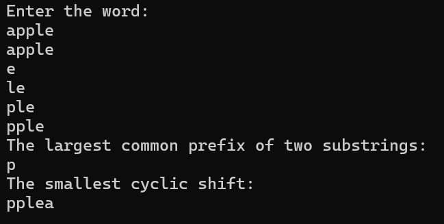
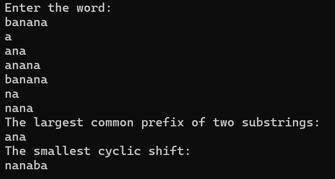
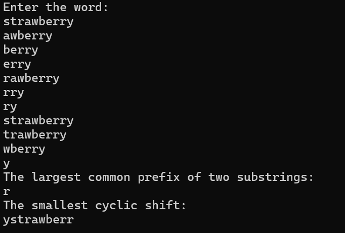

# Лабораторная работа №1
## Условие задания (Вариант 7)
Суффиксный массив. Построение суффиксного массива из строки. Нахождение наименьшего циклического сдвига строки. Наибольший общий префикс двух подстрок.

----

**Цель:** Исследовать свойства структур данных и разработать библиотеку алгоритмов обработки структур данных.

**Задача:** Разработать библиотеку для работы со структурой данных и систему тестов, которые продемонстрировали бы работоспособность реализованной библиотеки.

----

# Список понятий:

`Библиотека программного обеспечения (Библиотека кода)` – в программировании библиотека представляет собой совокупность программного кода, предназначенного для решения определенных задач. Этот код может содержать функции, классы, процедуры или другие компоненты, которые разработчики могут повторно использовать в своих программных проектах. Библиотеки упрощают разработку, так как они предоставляют готовые решения для типовых задач.

`Суффиксный массив`- это лексикографически отсортированный массив всех суффиксов строки.

`Наибольший общий префикс двух подстрок` - это последовательность символов, которая является общей для двух или более строк и начинается с начала каждой из них.

`Циклический сдвиг строки` - это алгоритм позволяет сдвигать элементы строки влево или вправо, сохраняя порядок элементов и обеспечивая цикличность.

----

# Алгоритм 

Класс `suffix_array`, включающий в себя все последующие функции и конструктор:
- Конструктор `suffix_array(string str)` с аргументом str типа string, который инициализирует вектора `vector<string> suffixes`(суффиксальный массив) и `vector<string> shifts`(циклические сдвиги).
- Функция `view()` записывает каждый элемент поля `suffixes` в переменную `str` и выводит.
- Функция `LCP()` сравнивает префиксы уже отсортированного суффиксального массива.
- Функция `SCS()` возвращает последний элемент (наименьший) отсортированного вектора циклических сдвигов.
 
 ----
 
# Примеры тестирования программы 

#### Тест1

#### Тест2

#### Тест3

----

# Источники
1.https://neerc.ifmo.ru/wiki/index.php?title=%D0%A1%D1%83%D1%84%D1%84%D0%B8%D0%BA%D1%81%D0%BD%D1%8B%D0%B9_%D0%BC%D0%B0%D1%81%D1%81%D0%B8%D0%B2

2.[https://acmp.ru/asp/do/index.asp?main=task&id_course=3&id_section=23&id_topic=241&id_problem=1562](http://e-maxx.ru/algo/suffix_array)

----

# Вывод
Составила суффиксный массив из строки. Разработала алгоритм поиска наименьшего циклического сдвига строки и наибольшего общий префикс двух подстрок.
