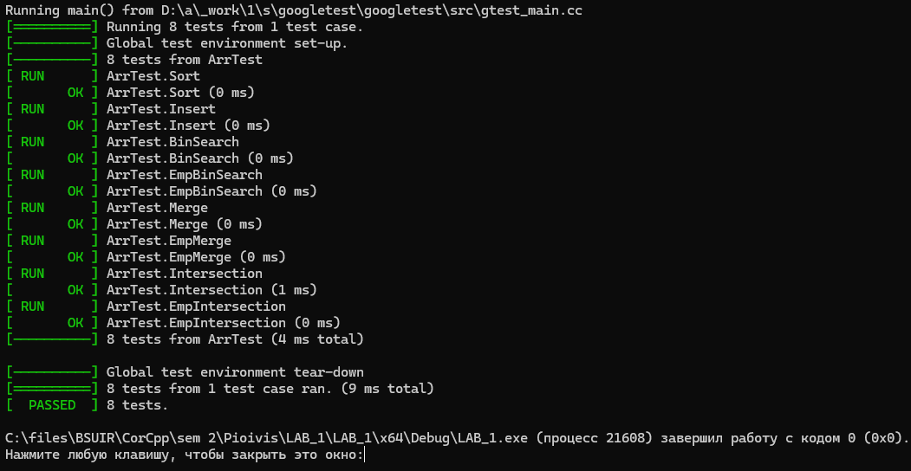

### Лабараторная работа №1
### Цель📌:

Цель моей лабараторной работы заключалась в изучении "очереди".

### Задача📑

Написать код на любом языке программирования.
Вот пример моего кода на с++:

### Разбор кода
1. В этом коде мы имеем класс "Solution".
2. В этом классе присуствуют две функции: "Take" & "SetQueue".
3. SetQueue выполняет задачу заполнения очереди.
4. Take выполняет задачу взятия n-го элемента очереди.
5. В коде представлены тесты в количестве: 3.
6. TestAdd выполняет проверку на правильность алгоритма взятия n-го элемента очереди.
7. TestOverflow выполняет проверку на корректность n.
8. TestHollowQueue выполняет проверку на взятие элемента из пустой очереди.
9. В этом коде соблюдены все требования к лабараторной работе.
10. TestHollowPop выполняет проверку на удаление в пустой очереди.
11. TestTwoAdds выполняет проверку на добавление 3 элементов и удаление 3 элементов и опять на добавление.

### Литература
<a href="https://www.klex.ru/1718">📗</a>.
<a href="https://www.google.by/books/edition/%D0%9E%D0%BB%D0%B8%D0%BC%D0%BF%D0%B8%D0%B0%D0%B4%D0%BD%D0%BE%D0%B5_%D0%BF%D1%80%D0%BE%D0%B3%D1%80%D0%B0%D0%BC%D0%BC/34KzDwAAQBAJ?hl=ru&gbpv=1&printsec=frontcover">📘</a>.
<a href="https://cchgeu.ru/upload/iblock/8b4/nrwdckls1bi7zzrfr2fnwx88145v1341/metodichka-Informatika-1.pdf">📕</a>.
