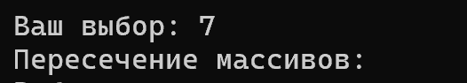

<h1>Лабораторная работа №1</h1>


## Цели:
* Изучить такую структуру данных, как двумерный массив
* Научиться правильно работать с двумерными массивами
* Уметь использовать основные алгоритмы при работе с двумерными массивами

## Задачи:
* Выполнить свой вариант лабораторной работы 
* Перенести получившееся решение на язык программирования С++
* Реализовать все указанные в задании действия с двумерным массивом

 ## Вариант 
Для выполнения лабораторной работы мне был выдан вариант **19**. Для двумерного массива использовал класс, в котором хранил сам массив, количество строк и длину каждой строки.

**Двумерным массивом** это одномерный массив, элементами которого являются одномерные массивы

Структура программы состояла из 3-х файло: **header.h**, **main.cpp**, **realisation.cpp**.


### Вставка элемента в массив ###

```
void Double_Arr::Insert_Elem(int elem, int row, int col)
{
    if (row < 0 || col < 0 || row >= rows || col > row_size[row])
    {
        cout << "Неверные параметры вставки" << endl;
        return;
    }

    int* newRow = new int[row_size[row] + 1];
    for (int i = 0; i < col; i++)
    {
        newRow[i] = arr[row][i];
    }
    newRow[col] = elem;
    for (int i = col; i < row_size[row]; i++)
    {
        newRow[i + 1] = arr[row][i];
    }
    delete[] arr[row];
    arr[row] = newRow;
    row_size[row]++;
}
```


### Сортировка двумерного массива ###

```
void Double_Arr::Sort()
{
    int n = 0;
    vector<int> temp;
    for (int i = 0; i < rows; i++)
    {
        for (int j = 0; j < row_size[i]; j++)
        {
            temp.push_back(arr[i][j]);
        }
    }
 
    for (int i = 0; i < temp.size(); i++)
    {
        for (int j = 0; j < temp.size() - i - 1; j++)
        {
            if (temp[j] > temp[j + 1])
            {
                swap(temp[j], temp[j + 1]);
            }
        }
    }
    
    for (int i = 0; i < rows; i++)
    {
        for (int j = 0; j < row_size[i]; j++)
        {
            arr[i][j] = temp[n];
            n++;
        }
    }
}
```
### Поиск элемента в массиве ###

```
void Double_Arr::Search_Elem(int elem)
{
    bool check_elem = false;
    for (int i = 0; i < rows; i++)
    {
        for (int j = 0; j < row_size[i]; j++)
        {
            if (arr[i][j] == elem)
            {
                cout << "Элемент находится на позиции (" << i << ", " << j << ")" << endl;
                check_elem = true;
            }
        }
    }

    if (!check_elem)
    {
        cout << "Елемент не найден";
    }
}
```

### Пересечение массивов ###

```
Double_Arr Double_Arr::Intersection(Double_Arr& second_arr)
{
    vector<vector<int>> resultVec;
    for (int i = 0; i < rows; i++)
    {
        for (int j = 0; j < second_arr.rows; j++)
        {
            if (row_size[i] == second_arr.row_size[j] && equal(arr[i], arr[i] + row_size[i], second_arr.arr[j])) 
            {
                resultVec.push_back(vector<int>(arr[i], arr[i] + row_size[i]));
                break;
            }
        }
    }

    int newRows = resultVec.size();
    Double_Arr result(newRows, 0);
    for (int i = 0; i < newRows; i++)
    {
        result.row_size[i] = resultVec[i].size();
        result.arr[i] = new int[result.row_size[i]];
        copy(resultVec[i].begin(), resultVec[i].end(), result.arr[i]);
    }
    
    return result;
}
```

### Объединение массивов ###

```
Double_Arr Double_Arr::Intersection(Double_Arr& second_arr)
{
    vector<vector<int>> resultVec;
    for (int i = 0; i < rows; i++)
    {
        for (int j = 0; j < second_arr.rows; j++)
        {
            if (row_size[i] == second_arr.row_size[j] && equal(arr[i], arr[i] + row_size[i], second_arr.arr[j])) 
            {
                resultVec.push_back(vector<int>(arr[i], arr[i] + row_size[i]));
                break;
            }
        }
    }

    int newRows = resultVec.size();
    Double_Arr result(newRows, 0);
    for (int i = 0; i < newRows; i++)
    {
        result.row_size[i] = resultVec[i].size();
        result.arr[i] = new int[result.row_size[i]];
        copy(resultVec[i].begin(), resultVec[i].end(), result.arr[i]);
    }
    
    return result;
}
```

## Тесты программы ##
Тесты программы будут проводится для следующих массивов: 

first_arr = [
    [1 2 3 4]
    [3 6 7 4]
    [1 4 6 8]
    [1 8 8 0]
]

second_arr = [
    [7 5 3 10]
    [3 3 6 9]
    [3 6 7 4]
    [1 2 0 0]
]

Меню программы выглядит следующим образом: 
<p align="center">

</p>

**Сортировка массива**

<p align="center">

</p>

**Вставка элемента в отсортированный массив**

<p align="center">

</p>

**Поиск элемента в отсортированном массиве**

<p align="center">

</p>

<p></p>
<p align="center">

</p>

<hr>

**Объединение отсортированных массивов**

<p align="center">

</p>

**Пересечение отсортированных массивов**

<p align="center">

</p>

## Вывод:

В результате лабораторной работы я научился работать с двумерным массивом как со структурой данных и реализовал для него некоторые операции на языке программирования С++.
## Используемые  источники
Не использовал