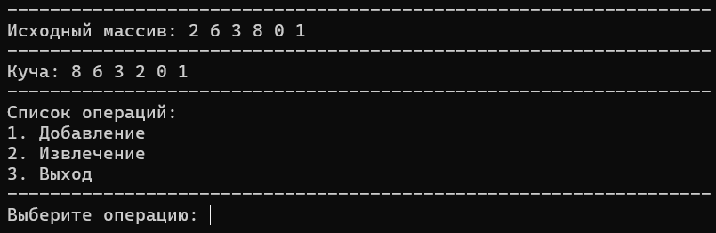
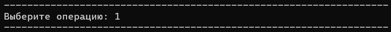

## Лабораторная работа №1
### Автор: Сечейко Николай, гр.421702
## Вариант 25. Приоритетная очередь

## Содержание

- [*Термины*](#термины)
- [*Введение*](#введение)
  - [*Цели и задачи*](#цели-и-задачи)
  - [*Вариант*](#вариант)
- [*Алгоритм*](#алгоритм)
  - [*Построение кучи*](#построение-кучи)
  - [*Вставка элементов*](#вставка-элементов)
  - [*Получение и удаление значения*](#получение-и-удаление-значения)
  - [*Тесты работы алгоритма*](#тесты-работы-алгоритма)
- [*Вывод*](#вывод)
- [*Список литературы*](#список-литературы)


## Термины

- **Приоритетная очередь (priority queue)** - абстрактный тип данных, похожий на очередь, но где каждый элемент имеет приоритет. Элемент с более высоким приоритетом обслуживается раньше элемента с более низким приоритетом.

- **Дерево (tree)** - иерархическая структура данных, состоящая из узлов, связанных между собой направленными ребрами без циклов, где есть один корневой узел.

- **Бинарное дерево (binary tree)** - дерево, в котором каждый узел имеет не более двух потомков (левый и правый).

- **Куча (heap)** - специализированное бинарное дерево, удовлетворяющее свойству кучи: значение в любом узле не меньше (для макс-кучи) или не больше (для мин-кучи) значений в его дочерних узлах.

- **Структура (struct)** - пользовательский тип данных, объединяющий несколько связанных элементов данных в одну логическую единицу.

- **Методы (methods)** - функции, являющиеся членами класса или структуры, имеющие доступ к их внутренним данным.

- **Шаблоны (templates)** - механизм в C++, позволяющий создавать обобщённый код, работающий с различными типами данных.


## Введение

### Цели и задачи

- Исследовать свойства структур данных.
- Разработать удобный инструмент для обработки структур данных.
- Создать файл, в котором реализовать методы для решения поставленной задачи.

### Вариант

В данной лабораторной работе представлено решение 25 варианта из [методички](https://drive.google.com/drive/folders/1AyWt3nPYPlhdaGD3Hlfrc33eyXt2OD84).
_Условие_: реализовать структуру данных приоритетной очереди. Реализовать функцию добавления, удаления, просмотра элемента.

## Алгоритм

Оптимальная и быстрая реализация заключается в использовании кучи. **Суть** заключается в том, чтобы хранить элементы в _"узлах"_ по возрастанию приоритета. Т.е. в вершине лежит элемент с максимальным приоритетом. Пример кучи:


### Построение кучи
Для построения кучи используется 2 функции:
```c++
int* creatingAnUnorderedHeap(int& n, int& lastSheetParentIndex) {
    wall();
    cout << "Введите количество элементов кучи: ";
    while (true) {
        cin >> n;
        if (n > 0) {
            break;
        }
        wall();
        cout << "Количество элементов должно быть положительным. Повторите ввод: ";
    }
    wall();

    lastSheetParentIndex = n / 2 - 1;

    int* heap = new int[n];

    for (int i = 0; i < n; i++) {
        cout << "Введите " << i + 1 << "-ый элемент: ";
        cin >> heap[i];
        wall();
    }

    system("pause");
    system("cls");
    return heap;
}
int* heapBuildBySiftDown(int n, int* heap, int lastSheetParentIndex) {
    for (int i = lastSheetParentIndex; i >= 0; i--) {
        int currentIndex = i;
        while (true) {
            int leftChildIndex = 2 * currentIndex + 1;
            int rightChildIndex = 2 * currentIndex + 2;
            int largestIndex = currentIndex;

            if (leftChildIndex < n && heap[leftChildIndex] > heap[largestIndex]) {
                largestIndex = leftChildIndex;
            }

            if (rightChildIndex < n && heap[rightChildIndex] > heap[largestIndex]) {
                largestIndex = rightChildIndex;
            }

            if (largestIndex != currentIndex) {
                swap(heap[currentIndex], heap[largestIndex]);
                currentIndex = largestIndex;
            }
            else {
                break;
            }
        }
    }
    return heap;
}
```
Функция `creatingAnUnorderedHeap` запрашивает у пользователя элементы для построения кучи, а функция `heapBuildBySiftDown` создаёт упорядоченность элементов, присущих свойствам кучи, используя метод SiftDown (просеивание вниз).

### Вставка элементов

```c++
void addToHeap(int*& heap, int& n, int curr) {
    system("cls");
    wall();
    cout << "Введите новый элемент: ";
    cin >> curr;
    wall();
    ofstream tempFile("temp_heap.txt");
    for (int i = 0; i < n; i++) {
        tempFile << heap[i] << " ";
    }
    tempFile << curr;
    tempFile.close();

    delete[] heap;

    ifstream inputFile("temp_heap.txt");
    n++;
    heap = new int[n];

    for (int i = 0; i < n; i++) {
        inputFile >> heap[i];
    }
    inputFile.close();

    int lastSheetParentIndex = n / 2 - 1;
    heapBuildBySiftDown(n, heap, lastSheetParentIndex);

    remove("temp_heap.txt");
    system("pause");
    system("cls");

}
```

Функция `addToHeap` добавляет новый элемент в кучу, запрашивая его значение у пользователя, временно записывая все элементы (старые и новый) во внешний файл, удаляя исходный динамический массив и создавая новый, увеличенный на единицу, затем считывает данные из файла в новый массив и восстанавливает свойства кучи с помощью функции heapBuildBySiftDown, после чего удаляет временный файл и завершает работу.

### Получение и удаление значения

```c++
int searchMax(int*& heap, int& n) {
    wall();
    int maximum = heap[0];
    heap[0] = heap[n - 1];
    n--;
    int lastSheetParentIndex = n / 2 - 1;
    heapBuildBySiftDown(n, heap, lastSheetParentIndex);
    return maximum;
}
```

Функция `searchMax` извлекает максимальный элемент из кучи, используя следующий алгоритм: сначала сохраняет значение максимального элемента (корня кучи), затем заменяет корень последним элементом массива (сокращая размер массива на единицу), восстанавливает свойства кучи путем перестановок через функцию heapBuildBySiftDown и возвращает сохраненный максимальный элемент.

## Тесты работы алгоритма

### Тест №1


### Тест №2


### Тест №3


### Тест №4







### Тест №5


## Вывод

В результате проделанной работы была создана убывающая куча (max-heap), позволяющая быстро вставлять новые значения и извлекать максимальный элемент. При добавлении элемент помещается в конец структуры и «поднимается» к корню при необходимости, сохраняя свойство кучи. При удалении максимальное значение извлекается из корня, а освободившееся место заполняется последним элементом с последующим «просеиванием» вниз. Все операции работают и подтвердили корректность в ходе тестирования.

## Список литературы

1. https://brestprog.by/topics/heap/
2. https://habr.com/ru/sandbox/199002/
3. https://www.geeksforgeeks.org/cpp-stl-heap/?ysclid=m7jhf79j6h630486325
4. https://ravesli.com/urok-105-stek-i-kucha/?ysclid=m7jhfoj58k935529866
5. https://metanit.com/cpp/tutorial/7.12.php?ysclid=m7jhg8gfeg841882733
