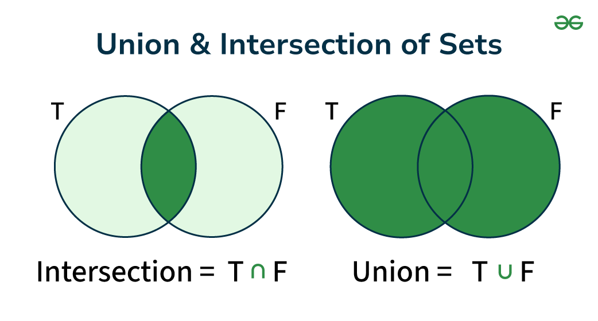
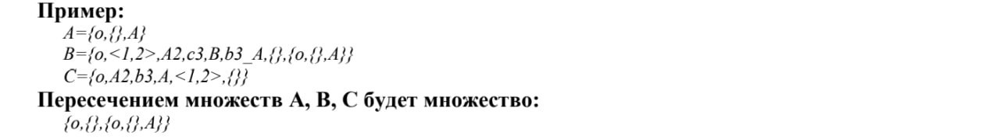
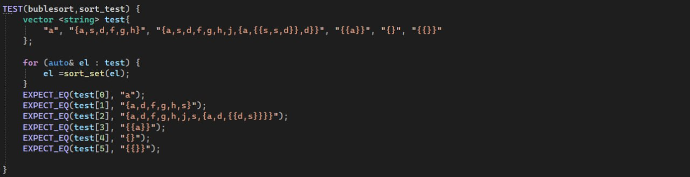
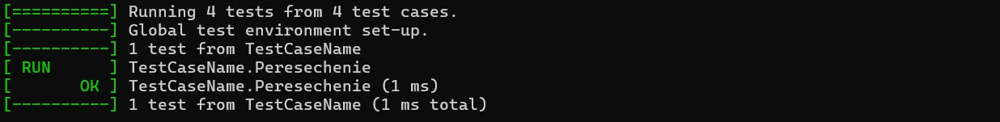
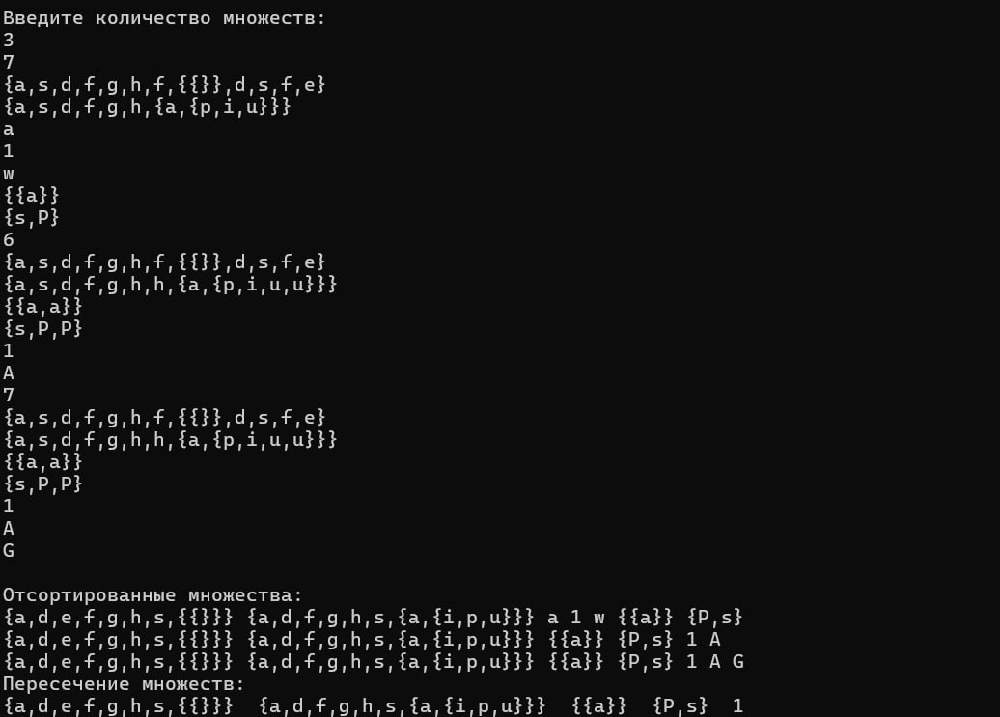

<h1>Лабораторная работа №2</h1>


## Цели:
* Изучить основные понятия, связанные  с множествами
* Научиться правильно выполять операции над множествами
* Уметь использовать основные свойства множеств

## Задачи:
* Выполнить свой вариант лабораторной работы 
* Перенести получившееся решение на язык программирования С++


 ## Вариант 
Для выполнения лабораторной работы мне был выдан вариант **2**. Для работы с множествами буду использовать библиотеку  **vector** и **string**

## Множество 

**Множество** – простейшая информационная конструкция и математическая структура,
позволяющая рассматривать какие-то объекты как целое, связывая их. Объекты, связываемые
некоторым множеством, называются элементами этого множества. Если объект связан
некоторым множеством, то говорят, что существует вхождение объекта в это множество, а
объект принадлежит этому множеству.

<p text-align:center></p>

<p></p>
Данная программа рассчитана на то, что множество может быть элементом множества
<p></p>


Основные части программы:

**1)** Сортировка
```C++
void bubble_sort(vector<string>& elements) {
    for (size_t i = 0; i < elements.size(); i++) {
        for (size_t j = 0; j < elements.size() - 1 - i; j++) {
            if (!compare_strings(elements[j], elements[j + 1])) {
                string temp = elements[j];
                elements[j] = elements[j + 1];
                elements[j + 1] = temp;
            }
        }
    }
}
```
**2)** Удаление повторяющихся элементов

```C++
void remove_duplicates(vector<string>& elements) {
    if (elements.empty()) return;
    vector <string> unique;
    for (int i = 0; i < elements.size(); i++) {
        bool flag = false;
        for (int j = 0; j < unique.size(); j++) {
            if (elements[i] == unique[j]) {
                flag = true;
                break;
            }
        }
        if (!flag) {
            unique.push_back(elements[i]);
        }
    }
    elements = unique;
}
```

**3)** Формирование множеств и разбиение
```C++
vector<string> get_elements(string& set) {
    vector<string> elements;
    string current;
    int bracket_count = 0;

    for (size_t i = 1; i < set.length() - 1; i++) {
        char c = set[i];

        if (c == '{') {
            bracket_count++;
            current += c;
        }
        else if (c == '}') {
            bracket_count--;
            current += c;
            if (bracket_count == 0) {
                elements.push_back(current);
                current.clear();
            }
        }
        else if (c == ',' && bracket_count == 0) {
            if (!current.empty()) {
                elements.push_back(current);
                current.clear();
            }
        }
        else {
            current += c;
        }
    }

    if (!current.empty()) {
        elements.push_back(current);
    }

    return elements;
}
string sort_set(string& set) {
    if (!is_set(set)) return set;

    vector<string> elements = get_elements(set);

    for (auto& element : elements) {
        if (is_set(element)) {
            element = sort_set(element);
        }
    }

    bubble_sort(elements);
    remove_duplicates(elements);

    string result = "{";
    for (size_t i = 0; i < elements.size(); i++) {
        if (i > 0) result += ",";
        result += elements[i];
    }
    result += "}";

    return result;
}
```

**4)** Функции для пересечения
```C++
void peresechenie(vector <string> tes, vector<string>& result) {
    vector <string> temp;
    for (auto& el : tes) {
        bool flag = false;
        for (auto& pers : result) {
            if (el == pers) {
                flag = true;
                break;
            }
        }
        if (flag) {
            temp.push_back(el);
        }
    }
    result.clear();
    result = temp;
}
void main_peresechenie(vector <Union>& testi, vector<string>& result) {
    vector <string>temp;
    for (int i = 1; i < testi.size(); i++) {
        peresechenie(testi[i].get_vector(), result);
    }
}
```


## Тестирование

**Использование  Google test**

Пример тестирования сортировки
<p></p>



<p></p>



 **Тесты в консоли**
 <p></p>
 

 #### Вывод:

Во время выполнения рассчетной работы проделал вот такую работу:
**1)** Повторил основные понятия теории множеств 
**2)** Изучил основные операции над множествами 
**3** Реализовал пересечение n-ого количества множеств в виде программы на языке С+


#### Используемые  источники

#### Свободная энциклопедия "Википедия" [Электронный ресурс]-Режим доступа

* https://ru.m.wikipedia.org/wiki/


### Google Disk 
* https://drive.google.com/drive/folders/1_xy849HXgTDetxSMlFd0KikTBo8-xalN

