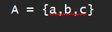
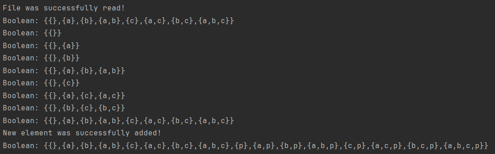

## Лабораторная работа №2
## Вариант 5
### Автор: Шумилов Артем, гр. 421702

## Содержание

- [*Глоссарий*](#глоссарий)
- [*Введение*](#введение)
    - [*1.1 Цели*](#цели)

    - [*1.2 Постановка задачи*](#постановка-задачи)

- [*2 Алгоритм*](#алгоритм)

    - [*2.1 Описание алгоритма*](#описание-алгоритма)
        
    - [*2.2 Реализация алгоритма*](#реализация-алгоритма)

- [*3 Пример работы пргораммы*](#пример-работы-программы)

- [*4 Выводы*](#выводы)


## Глоссарий

- _Множество_ – коллекция уникальных элементов
- _Булеан_ – множество всех подмножеств данного множества, включая пустое множество и само множество
- _Подмножество_ – множество, все элементы которого принадлежат другому множеству
- _Побитовый сдвиг_ — это операция в программировании, которая перемещает биты числа влево или вправо
- _Оператор побитового И (&)_ – выполняет логическую операцию И над соответствующими битами двух чисел

## Введение

### Цели

На выбранном ЯП реализовать нахождение булеана множества

### Постановка задачи

В ходе выполнения работы использовать структуры данных (или классы), которые должны быть декларированы в header-файлах, а реализованы – в .cpp

Код должен быть хорошо декомпозирован, а его элементы имели наименования согласно общепринятым стандартам

При выполнении лабораторной работы запрещено использовать глобальные переменные

Все функции и некоторые переменные должны иметь комментарий с описанием

Для любых некорректных входных данных программа должна
сообщать о некорректности входных данных и не должна терять управления в результате
ошибки исполнения

Все входные данные должны читаться программой из файла.

## Алгоритм

### Описание алгоритма

Программа считывает строку из текстового файла и извлекает из нее множество. Членами множества считаются элементы, разделенные запятыми. Внешние скобки и разделительные запятые не являются элементами множества

Булеан имеет мощность 2^|M|, где |M| - мощность множества, для которого находится булеан

Для нахождения булеана применяется побитовый сдвиг вправо для i = {0, ..., 2^|M| - 1}. i-тые подмножества состоят из элементов, порядковый номер которых в начальном множестве эквивалентен позиции единиц, считая с правой стороны, в двоичном представлении i

Для каждого подмножества булеана можно найти булеан


### Реализация алгоритма 
Множества в алгоритме реализованы на базе класса
Каждое множество имеет vector, содержащий все элементы этого множества

Метод _divideWords_ разделяет переданную в него строку на отдельные слова и добавлет их в vector элементов множества

Метод _extractSet_ извлекает множество из строки, считанной с файла

Метод _getSubSet_ формирует подмножество из элементов начального множества

Метод _displaySet_ выводит в консоль элементы множества

Класс содержит в себе несколько видов конструкторов, которые содержат разные способы создания объекта класса в зависимости от переданных даных

Метод _getBoolean_ расчитывает булеан и возвращает его. Каждое подмножество булеана является объектом класса Set

Метод _addElement_ добавляет новый элемент во множество

Метод _displayBoolean_ выводит в консоль элементы булеана

```hpp
    class Set{
        private:
            std::vector< std::string> setElements; //хранилище элементов множества
            bool isCorrect(std::string str);
            void divideWords(std::string str);
            bool extractSet(std::string& str);
            std::vector< std::string> getSubSet(int n);
            void displaySet();
        public:
            Set();
            explicit Set(std::string str);
            explicit Set(std::vector< std::string> elements);
            void addElement(std::string element);
            std::vector< Set> getBoolean();
            void displayBoolean();
    };
```

<br>

Строка разделяется на слова по запятым, после чего запятые удаляются

**(!)** Запятые в подмножествах считанного множества не учавствуют в разделении строки на слова и не удаляются

```cpp
    void Set::divideWords(std::string str){ //Разделение строки на слова
        size_t i = 0;
        int openPar = 0;
        while(!str.empty()){
            if(str[i] == ',' && openPar == 0){ //слова разделяются запятыми
                setElements.push_back(str.substr(0, i));
                str.erase(0, i + 1);
                i = 0;
            }
            else i++;

            if(str[i] == '{')
                openPar++;
            else if(str[i] == '}')
                openPar--;
        }
    }
```

<br>

В методе извлечения подмножества используется побитовый сдвиг. В параметрах передается порядковый номер подмножества n.  Цикл за каждую итерацию увеличивает переменную i на 1. Он выполняется до тех пор, пока n не станет равно 0
 
За каждую итерацию n побитово сравнивается с 1. Если последний бит n равен 1, то в текущее подмножество добавляется i-тый элемент vector-а, содержащего все элементы множества. Иначе осуществляется побитовый сдвиг вправо
```cpp
    std::vector< std::string> Set::getSubSet(int n){ //Извлечение подмножества из начального множества
        int i = 0;
        std::vector< std::string> temp;
        while (n){
            if (n & 1)
                temp.push_back(setElements[i]);
            i++;
            n >>= 1;
        }
        return temp; //Возвращает извлеченное подмножество
    }
```

## Пример работы программы 




## Выводы

В результате выполнения работы удалось:
1. реализовать нахождение булеана на ЯП С++
2. попрактиковаться в работе с классами

Все поставленные цели были достигнуты, а задачи выполнены
