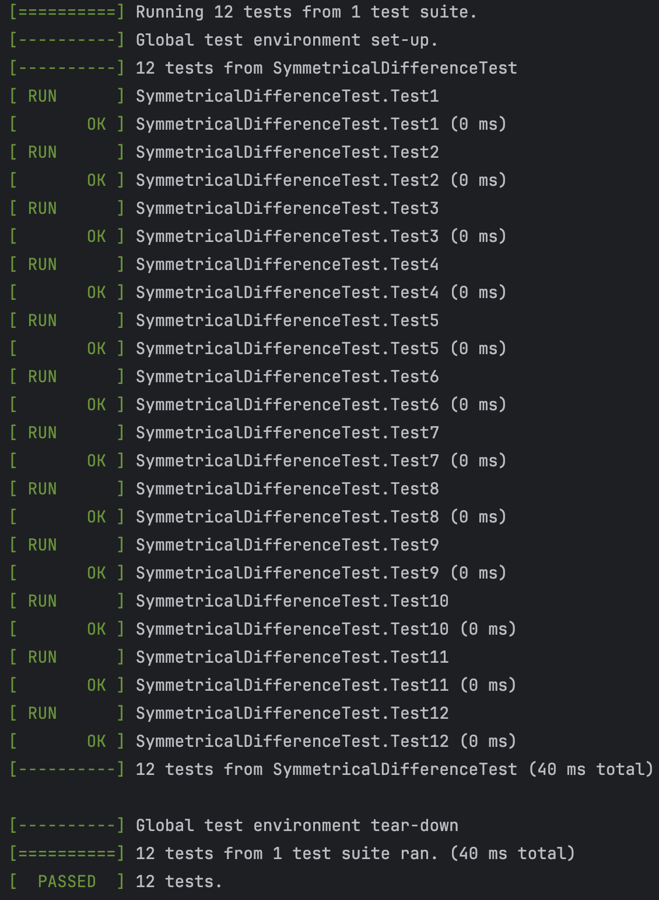

# Лабораторная работа №2. Множества
## Цель работы
- Научиться работать с множествами.
- Научиться разрабатывать алгоритмы выполнения операций над множествами.
## Задачи
- Разработать алгоритм одной из операций над множествами.
- Разработать систему тестов, которые продемонстрировали бы работоспособность реализованного алгоритма.
## Вариант
Мой вариант – вариант 12 [методички](https://drive.google.com/drive/folders/1_xy849HXgTDetxSMlFd0KikTBo8-xalN). Нужно реализовать алгоритм вычисления симметрической разности N множеств.
## Список используемых при решении задачи понятий
- Множество – одно из ключевых понятий математики, представляющее собой набор, совокупность объектов любой природы.
- Элементы множества – объекты, составляющие множество.
- Объект принадлежит множеству тогда и только тогда, когда он является его элементом.
- Говорят, что если объект принадлежит множеству, то существует вхождение этого элемента в множество. Допускается неограниченное количество вхождений
одного объекта в какое-либо множество.
- Например, есть множество _S = {a, b, a, a, c}_. В нём элементы _a_, _b_ и _c_ принадлежат множеству _S_, причём множество _S_ имеет три вхождения элемента _a_ (_S|a|_ = 3) и по одному вхождению элементов _b_ и _c_ (_S|b|_ = _S|c|_ = 1).
- Множеством с кратными вхождениями элементов называют множество _S_ тогда и только тогда, когда существует _x_ такой, что истинно _S|x|_ > 1.
- __Симметрической разностью__ множеств _A_ и _B_ с учётом кратных вхождений элементов будем называть множество _S_ тогда и только тогда, когда для любого _x_ истинно _S|x| = max{A|x|-B|x|, B|x|-A|x|}_. Выражение можно упростить: для любого _x_ истинно _S|x| = |A|x|-B|x||_ (модуль разности кратностей _x_ в множествах A и B).
## Реализация
Я создал  класс Set, представляющий собой множество. Множество представляет собой обычный массив, с одним лишь отличием: порядок элементов не важен.
```C++
template<typename T>
class Set
{
private:
	T *m_data;              // элементы
	size_t *m_multiplicity; // кратность их вхождения
	size_t m_size;          // размер массива
	size_t m_capacity;      // емкость (нужно для того, чтобы при
                                // помещениии нового элемента не пересоздавать
                                // массив каждый раз, что увеличит
                                // произодительность)
};
```
Конструктор выглядит следующим образом (конструктор только по умолчанию):
```C++
Set()
{
	this->m_size = 0;
	this->m_capacity = 1;
	this->m_data = new T[this->m_capacity];
	this->m_multiplicity = new size_t[m_capacity];
}
```
Для реализации также пришлось сделать оператор присваивания множества:
```C++
Set &operator=(const Set &s)
{
	if (this != &s) // проверка на самоприсваивание
	{
                // удаление прошлого объекта 
		this->m_size = 0;
		this->m_capacity = 0;
		
		delete[] m_data;
		delete[] m_multiplicity;
			
		this->m_data = nullptr;
		this->m_multiplicity = nullptr;
		
                // создание нового со значениями присваемого
		this->m_size = s.m_size;
		this->m_capacity = s.m_capacity;
			
		this->m_data = new T[this->m_capacity];
		this->m_multiplicity = new size_t[this->m_capacity];
		
		for (size_t i = 0; i < this->m_size; i++)
		{
			this->m_data[i] = s.m_data[i];
			this->m_multiplicity[i] = s.m_multiplicity[i];
		}
	}
	return *this;
}
```
Вставка элемента в множество выполняется следующим образом:
```C++
/**
 * @brief Вставка элемента множества с определённой кратностью.
 *
 * @param value - элемент.
 * @param count - кратность элемента.
 */
void insert(const T &value, size_t count)
{
	for (size_t i = 0; i < this->m_size; i++)
	{
		if (this->m_data[i] == value)
		{
                        // увеличиваем кратность если элемент существует
			this->m_multiplicity[i] += count;
			return;
		}
	}
	
	if (this->m_size == this->m_capacity)
	{
                // если емкости не хватает то пересоздаем массив с новым
                // значением емкости
		this->m_capacity = this->m_capacity * 3 / 2 + 1;
		
		T *dataAux = new T[this->m_capacity];
		auto *multiplicityAux = new size_t[this->m_capacity];
		for (size_t i = 0; i < this->m_size; i++)
		{
			dataAux[i] = this->m_data[i];
			multiplicityAux[i] = this->m_multiplicity[i];
		}
		
		delete[] this->m_data;
		delete[] this->m_multiplicity;
		
		this->m_data = dataAux;
		this->m_multiplicity = multiplicityAux;
	}
	
        // создаем новый элемент
        this->m_data[this->m_size++] = value;
	this->m_multiplicity[this->m_size - 1] = count;
}
```
Получение кратности какого-либо объекта относительно множества тривиально и не требует объяснений
```C++
/**
 * @brief Кратность определённого элемента множества.
 *
 * @param value - элемент.
 * @return size_t - кратность.
 */
size_t getMultiplicity(const T &value)
{
	for (size_t i = 0; i < this->m_size; i++)
	{
		if (this->m_data[i] == value)
		{
			return this->m_multiplicity[i];
		}
	}
	
	return 0;
}
```
Также для реализации нужно знать размер массива __m_data__.
```C++
/**
 * @brief Размер множества.
 *
 * @return size_t размер.
 */
size_t getSize()
{
	return this->m_size;
}
```
Также, иногда нужно получать сами элементы массива __m_data__.
```C++
/**
 * @brief Все элементы множества в динамическом массиве.
 *
 * @param destination - динамический массив, куда надо записать множес-
 *                      тво.
 */
void getElements(T *&destination)
{
	if (destination != nullptr)
	{
		delete[] destination;
		destination = nullptr;
	}
		
	if (this->m_size != 0)
	{
		destination = new T[this->m_size];
		for (size_t i = 0; i < this->m_size; i++)
		{
			destination[i] = this->m_data[i];
		}
	}
}
```
И последнее, что нужно было добавить в класс Set – это проверку на принадлежность множеству
```C++
/**
 * @brief Существует ли элемент в множестве.
 *
 * @param value - элемент.
 * @return true - если элемент найден.
 * @return false - если нет.
 */
bool isFound(const T &value)
{
	return this->getMultiplicity(value) != 0;
}
```
Для расчета симметрической разности от двух элементов я пользовался определением симметрической разности с учетом кратности вхождений элементов.
```C++
/**
 * @brief Симметрическая разность двух множеств.
 *
 * @param a - первое множество.
 * @param b - второе множество.
 * @return Set<T> - симметрическая разность.
 */
template<typename T>
Set<T> symmetricalDifference2arg(Set<T> a, Set<T> b)
{
	Set<T> s;
	
	T *aElements = nullptr;
	a.getElements(aElements);
	for (size_t i = 0; i < a.getSize(); i++)
	{
		s.insert(aElements[i],
		         std::abs((int)a.getMultiplicity(aElements[i]) -
		                  (int)b.getMultiplicity(aElements[i])));
	}
	
	T *bElements = nullptr;
	b.getElements(bElements);
	for (size_t i = 0; i < b.getSize(); i++)
	{
		if (!s.isFound(bElements[i]))
		{
			s.insert(bElements[i],
			         std::abs((int)a.getMultiplicity(bElements[i]) -
			                  (int)b.getMultiplicity(bElements[i])));
		}
	}
	
	delete[] aElements;
	delete[] bElements;
	
	return s;
}
```
А для обобщения этой операции на N множеств, я воспользовался свойством ассоциативности. Поскольку данная операция ассоциативна, то при последовательном ее применении на трёх и более множествах результат будет накапливаться.
```C++
template<typename T>
Set<T> symmetricalDifference(Set<T> args[], size_t count)
{
	Set<T> result;
	
	for (size_t i = 0; i < count; i++)
	{
		result = symmetricalDifference2arg(result, args[i]);
	}
	
	return result;
}
```
## Тестирование
Я тестировал программу при помощи unit-тестов, используя фреймворк GoogleTest. Для unit-тестирования пришлось реализовывать операторы сравнения множеств.
```C++
// Операторы определены как friend-функции для класса Set

template<typename T>
bool operator==(Set<T> lhs, Set<T> rhs)
{
	for (size_t i = 0; i < lhs.m_size; i++)
	{
		if (rhs.getMultiplicity(lhs.m_data[i]) != lhs.m_multiplicity[i])
		{
			return false;
		}
	}
	for (size_t i = 0; i < rhs.m_size; i++)
	{
		if (lhs.getMultiplicity(rhs.m_data[i]) != rhs.m_multiplicity[i])
		{
			return false;
		}
	}
	return true;
}

template<typename T>
bool operator!=(Set<T> lhs, Set<T> rhs)
{
	return !(lhs == rhs);
}
```
Всего я протестировал программу на 6 тестовых примерах, каждый их которых был пройден успешно.
```
Тестовый пример №1:
Входные данные:
{ 1 1 2 5 5 5 6 }
{ 2 2 2 4 4 5 5 6 7 }
{ 3 4 7 9 15 }
Выходные данные:
{ 1 1 2 2 3 4 5 9 15 }

Тестовый пример №2:
Входные данные:
{ a b c }
{ c a b e e }
Выходные данные:
{ e e }

Тестовый пример №3:
Входные данные:
{ }
{ }
{ }
{ }
Выходные данные:
{ }

Тестовый пример №4:
Входные данные:
{ 1 2 }
Выходные данные:
{ 1 2 }

Тестовый пример №5:
Входные данные:
{ 1 1 6 5 5 5 2 }
{ 2 2 2 5 5 4 4 7 6 }
Выходные данные:
{ 2 2 4 4 1 1 7 5 }

Тестовый пример №6:
Входные данные:
{ { 1 2 } }
Выходные данные:
{ { 1 2 } }
```
Все тесты были успешно пройдены:

Код для unit-тестов:
```C++
#include <gtest/gtest.h>

#include "SymmetricalDifference.hpp"

TEST(SymmetricalDifferenceTest, Test1)
{
	Set<int> s[3];
	
	s[0].insert(1, 2);
	s[0].insert(2, 1);
	s[0].insert(5, 3);
	s[0].insert(6, 1);
	
	s[1].insert(2, 3);
	s[1].insert(4, 2);
	s[1].insert(5, 2);
	s[1].insert(6, 1);
	s[1].insert(7, 1);
	
	s[2].insert(3, 1);
	s[2].insert(4, 1);
	s[2].insert(7, 1);
	s[2].insert(9, 1);
	s[2].insert(15, 1);
	
	Set<int> expectedResult;
	expectedResult.insert(1, 2);
	expectedResult.insert(2, 2);
	expectedResult.insert(3, 1);
	expectedResult.insert(4, 1);
	expectedResult.insert(5, 1);
	expectedResult.insert(9, 1);
	expectedResult.insert(15, 1);
	
	ASSERT_EQ(symmetricalDifference(s, 3), expectedResult);
}

TEST(SymmetricalDifferenceTest, Test2)
{
	Set<char> s[2];
	
	s[0].insert('a', 1);
	s[0].insert('b', 1);
	s[0].insert('c', 1);
	
	s[1].insert('c', 1);
	s[1].insert('b', 1);
	s[1].insert('a', 1);
	s[1].insert('e', 2);
	
	Set<char> expectedResult;
	expectedResult.insert('e', 2);
	
	ASSERT_EQ(symmetricalDifference(s, 2), expectedResult);
}

TEST(SymmetricalDifferenceTest, Test3)
{
	Set<float> s[4];
	
	Set<float> expectedResult;
	
	ASSERT_EQ(symmetricalDifference(s, 4), expectedResult);
}

TEST(SymmetricalDifferenceTest, Test4)
{
	Set<int> s[1];
	
	s[0].insert(1, 1);
	s[0].insert(2, 1);
	
	Set<int> expectedResult;
	expectedResult.insert(1, 1);
	expectedResult.insert(2, 1);
	
	ASSERT_EQ(symmetricalDifference(s, 1), expectedResult);
}

TEST(SymmetricalDifferenceTest, Test5)
{
	Set<int> s[2];
	
	s[0].insert(1, 2);
	s[0].insert(6, 1);
	s[0].insert(5, 3);
	s[0].insert(2, 1);
	
	s[1].insert(2, 3);
	s[1].insert(5, 2);
	s[1].insert(4, 2);
	s[1].insert(7, 1);
	s[1].insert(6, 1);
	
	Set<int> expectedResult;
	expectedResult.insert(2, 2);
	expectedResult.insert(4, 2);
	expectedResult.insert(1, 2);
	expectedResult.insert(7, 1);
	expectedResult.insert(5, 1);
}

TEST(SymmetricalDifferenceTest, Test6)
{
	Set< Set<int> > s[1];
	
	Set<int> ss;
	ss.insert(1, 1);
	ss.insert(2, 1);
	
	s[0].insert(ss, 1);
	
	Set< Set<int> > expectedResult;
	
	Set<int> ssExpected;
	ssExpected.insert(1, 1);
	ssExpected.insert(2, 1);
	
	expectedResult.insert(ssExpected, 1);
	
	ASSERT_EQ(symmetricalDifference(s, 1), expectedResult);
}

int main(int argc, char *argv[])
{
	testing::InitGoogleTest(&argc, argv);
	return RUN_ALL_TESTS();
}
```
## Вывод
В ходе данной лабораторной работы я:
- Научился работать с множествами
- Научиться разрабатывать алгоритмы выполнения операций над множествами.